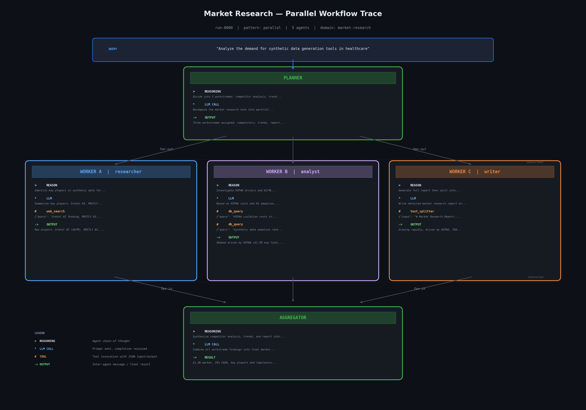

# ocelgen — Open Agent Traces Dataset Generator

Generate realistic multi-agent workflow trace datasets with LLM-enriched content. Built for the AI agent ecosystem.

[](https://huggingface.co/datasets/juliensimon/open-agent-traces)
[](https://github.com/juliensimon/ocel-generator/actions)
[](LICENSE)
[](https://python.org)
[](https://www.ocel-standard.org/)
[](docs/user-guide.md#model-and-endpoint-configuration)



## The problem

Real agent traces are scarce. Production multi-agent systems generate rich execution data — LLM prompts, tool calls, agent reasoning, handoff messages — but these traces are proprietary and rarely shared. Teams building agent observability, evaluation, and debugging tools lack open datasets to develop against.

## The solution

ocelgen generates **structurally valid, semantically rich** agent traces that look and feel like real multi-agent executions:

- **Full trace content** — LLM prompts and completions, tool call inputs/outputs, agent reasoning, inter-agent messages
- **10 enterprise domains** — customer support, code review, incident response, financial analysis, and 6 more (plus custom domains via YAML)
- **3 workflow patterns** — sequential, supervisor/worker, parallel fan-out/fan-in
- **Labeled deviations** — 10 types of anomalies (wrong tools, skipped steps, timeouts) with ground-truth annotations
- **OCEL 2.0 standard** — compatible with process mining tools (PM4Py, Celonis)
- **Any LLM backend** — OpenRouter, OpenAI, Anthropic, local models via OpenAI-compatible API

## Quick start

```bash
git clone https://github.com/juliensimon/ocel-generator.git && cd ocel-generator
uv sync
```

### LLM setup

Enrichment requires an OpenAI-compatible endpoint. Pick one:

**Cloud (OpenRouter, OpenAI, etc.)**
```bash
export OPENAI_API_KEY="your-key"
# Default: OpenRouter with Gemini Flash. Override with --model:
ocelgen enrich output.jsonocel -d customer-support-triage --model anthropic/claude-sonnet-4
```

**Local (llama.cpp, Ollama, vLLM, etc.)**
```bash
# Example: start llama.cpp with auto-download from Hugging Face
llama-server -hfr unsloth/Qwen3-30B-A3B-GGUF:Q6_K -ngl 99 -c 4096

# Point ocelgen at the local endpoint (no API key needed)
ocelgen enrich output.jsonocel -d customer-support-triage \
  --model unsloth/Qwen3-30B-A3B-GGUF:Q6_K \
  --base-url http://localhost:8080/v1
```

### Generate and enrich

```bash
# Generate traces
ocelgen generate --pattern sequential --runs 50 --noise 0.2

# Enrich with LLM-generated content
ocelgen enrich output.jsonocel --domain customer-support-triage

# Or run the full pipeline (generate + enrich + upload to HF)
ocelgen pipeline --domain customer-support-triage --namespace your-hf-username

# Use custom domains defined in YAML
ocelgen pipeline --domain my-domain --config domains.yaml --namespace your-hf-username
```

## Use the pre-built dataset

Skip generation — load the dataset directly from Hugging Face:

```python
from datasets import load_dataset

ds = load_dataset("juliensimon/open-agent-traces", "incident-response")

for event in ds["train"]:
    if event["run_id"] == "run-0000":
        print(f"{event['event_type']:25s} | {event['agent_role']:12s} | {event['reasoning'][:60] if event['reasoning'] else ''}")
```

10 domains available: `customer-support-triage` · `code-review-pipeline` · `market-research` · `legal-document-analysis` · `data-pipeline-debugging` · `content-generation` · `financial-analysis` · `incident-response` · `academic-paper-review` · `ecommerce-product-enrichment`

## Who is this for?

- **Agent observability teams** — build dashboards with realistic trace data (timestamps, token counts, costs)
- **ML researchers** — train anomaly detectors on labeled conformant vs deviant traces
- **Process mining researchers** — apply OCEL 2.0 conformance checking to agent workflows
- **Agent framework developers** — test LangGraph, CrewAI, AutoGen, Smolagents against realistic traces
- **Evaluation teams** — benchmark agent reasoning quality across domains and architectures

## Documentation

- **[Quick Start](docs/quickstart.md)** — first dataset in 5 minutes
- **[User Guide](docs/user-guide.md)** — CLI reference, patterns, domains, custom YAML config, model configuration
- **[Dataset on Hugging Face](https://huggingface.co/datasets/juliensimon/open-agent-traces)** — 17,000+ events, ready to use

## License

MIT
